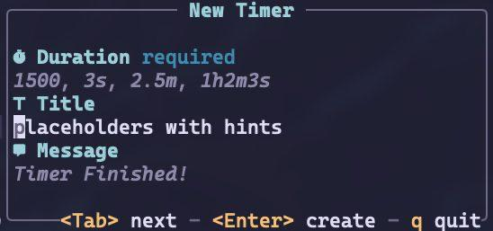

# timers.nvim

`timers.nvim` is a simple timer management plugin for Neovim that allows you to
**run, track, and manage multiple timers**. Its core focus is **extensibility**
and providing a **clean API** for other plugins or custom configurations.

> [!WARNING]
>
> **This project is in active development. The API can change at any time until
> a stable release.**

## Table Of Contents

<!--toc:start-->
- [timers.nvim](#timersnvim)
  - [Table Of Contents](#table-of-contents)
  - [Why not X?](#why-not-x)
  - [Installation](#installation)
    - [Options](#options)
    - [Keymaps](#keymaps)
  - [Commands](#commands)
    - [Duration format](#duration-format)
  - [Integrations](#integrations)
    - [Lualine](#lualine)
      - [Closest timer](#closest-timer)
  - [API](#api)
  - [TODO](#todo)
<!--toc:end-->

## Why not X?

Yes, there are already Neovim timer plugins out there — for example:

- [pulse.nvim](https://github.com/linguini1/pulse.nvim)
- [pomo.nvim](https://github.com/epwalsh/pomo.nvim)
- [timerly](https://github.com/nvzone/timerly)

Each focuses on a different aspect of timers, whether it’s specific presets,
timer management, or something else.

So why make another one?

We wanted to explore a slightly different approach: focusing on hackability and
providing a good API that other plugins can build on. Instead of being a
complete opinionated timer solution, this plugin is designed to be extensible
and easy to integrate.

If you’re looking for a timer that "just works" out of the box, the other
plugins are great! But if you want something flexible and composable for
custom workflows, maybe try ours.

---

Also, this is my first Neovim plugin. Part of the goal here is just to
experiment with Neovim API and build something without relying on something
pre-built, like [plenary](https://github.com/nvim-lua/plenary.nvim) or
[nui](https://github.com/MunifTanjim/nui.nvim)

## Installation

Using `lazy.nvim`:

```lua
{
  'ravsii/timers.nvim',
  -- See below, empty is fine
  opts = {},
}
```

### Options

These options are used by default and you don't need to pass all of them.

```lua
{
  'ravsii/timers.nvim',
  ---@module "timer.config"
  ---@type Config
  opts = {
    -- Save timers across reloads / sessions.
    -- If true, neovim will save your active timers on disk and load them
    -- back after you enter it again.
    -- Keep in mind that timer is _still_ ticking, even when Neovim is
    -- closed.
    persistent = false,
    -- Default values for new timers, if they weren't passed explicitly.
    default_timer = {
      icon = "󱎫",
      log_level = vim.log.levels.INFO,
      message = "Timer Finished!",
      title = "timers.nvim",
    },
    dashboard = {
      -- Dashboard update interval, ms.
      -- Timers don't show anything below seconds (ms, ns, etc) anyways.
      update_interval = 1000,
      -- [0,1] for percentage of the screen, (1,∞) for an absolute value.
      width = 0.8,
      -- [0,1] for percentage of the screen, (1,∞) for an absolute value.
      height = 0.8,
    },
  },
}
```

### Keymaps

These are examples using `lazy.nvim` format.
If you like command-style  (`<cmd>TimersDashboard<cr>`) binds more,  see: [commands](#commands)

```lua
{
  "ravsii/timers.nvim",
  keys = {
    { "<leader>T", "", desc = "+timers" },
    { "<leader>Ta", function() require("timers.ui").active_timers() end, desc = "Active timers" },
    { "<leader>Td", function() require("timers.ui").dashboard() end, desc = "Dashboard" },
    { "<leader>Tn", function() require("timers.ui").create_timer() end, desc = "New timer" },
    { "<leader>Tc", function() require("timers.ui").cancel() end, desc = "Cancel a timer" },
    { "<leader>TC", function() require("timers.ui").cancel_all() end, desc = "Cancel all timers" },
  },
}
```

## Commands

- `:TimersCreate` - Like `:TimersStart`, but with interactive UI.

- `:TimersStart <duration> <message?>` - Starts a new timer.
  - `<duration>`: required, e.g. `10s`, `2m`, `1h30m`. See [Duration
  format](#duration-format)
  - `<message?>`: optional. Everything after the first space is treated as a
  message.

```vim
:TimersStart 10                          " 10 milliseconds
:TimersStart 1500 Quick ping             " 1500 milliseconds (1.5s)
:TimersStart 45s Quick notification      " 45 seconds
:TimersStart 3m Take a short break!      " 3 minutes
:TimersStart 3.5m Stretch now!           " 3 minutes 30 seconds
:TimersStart 1.75h Long task reminder    " 1 hour 45 minutes
:TimersStart 10h29m59s Complex Time      " 10 hours 29 minutes and 59 seconds
```

- `:TimersActive` - Shows active timers (`vim.ui.select`)
- `:TimersCancel <id?>` - Cancel a specific timer by its ID.
  - `<id?>`: optional. If no id given, it'll open up in interactive UI
  (`vim.ui.select`)
- `:TimerCancelAll` - Cancel all active timers.
- `:TimerDashboard` — Opens the dashboard. This is still a work in progress and
mainly serves as a proof of concept.


> [!NOTE]
>
> All these commands have a lua equivalent, that could be found using
> `require("timers.ui")`

### Duration format

- `s` → seconds
- `m` → minutes
- `h` → hours
- Numbers without a unit are treated as milliseconds

## API

This section will be filled later.

For now you can check [my config](https://github.com/ravsii/.dotfiles/blob/main/dot_config/nvim/lua/plugins/timer.lua)
or see [.nvim.lua](./.nvim.lua). The former one is used for testing, so it's
always up-to-date.

### Recepes

#### Pomodoro 25/5 timer

```lua
local pomodoro_25_5 = function()
  local t = require("timers.timer")
  local d = require("timers.duration")
  local u = require("timers.unit")
  local m = require("timers.manager")

  local break_duration = d.from(5 * u.MINUTE)
  local break_timer = t.new(break_duration, {
    message = "Break is over",
    title = "Break",
    log_level = vim.log.levels.WARN,
    icon = "⏾",
  })

  local ppomodoro_duration = d.from(25 * u.MINUTE)
  local pomodoro_timer = t.new(ppomodoro_duration, {
    title = "Pomodoro",
    message = "Pomodoro is over",
    icon = "",
    on_finish = function() m.start_timer(break_timer) end,
  })

  m.start_timer(pomodoro_timer)
end

-- and in keys you can now use
keys = {
  { "<leader>Tp", pomodoro_25_5, desc = "Start Pomodoro 25/5 timer" },
}
```

#### Infinite timer

Creates a 5s timer, that just keeps restarting itself, until canceled.

```lua
local infinite_timer -- new var here, so we can access it in on_finish
infinite_timer = t.new(d.from(5 * u.SECOND), {
  title = "Infinite",
  message = "It never ends",
  icon = "♾️",
  on_finish = function()
    m.start_timer(infinite_timer)
  end,
})

m.start_timer(infinite_timer)
```

#### Closest timer for [`lualine.nvim`](https://github.com/nvim-lualine/lualine.nvim)

You can display the closest timer to expire in `lualine`:


```lua
{
  'nvim-lualine/lualine.nvim',
  opts = {
    sections = {
      -- other secions
      lualine_z = {
        { function() return require("timers.integrations.lualine").closest_timer() end },
        { 'progress' },
      },
    },
  },
}
```

## Known bugs

1. **** Cancel (c) keybind is currently not perfectly synced with the
   dashboard ui, so it could potentially cancel a different timer. Use
`:TimersCancel` instead.

## TODO

- [x] Picker integrations
  - [x] `vim.ui.select`
  - [ ] `Snacks` - probably won't do for now, because `vim.ui.select` can do
  everything I need, and its api is widely supported across multiple plugins.
- [ ] Fullscreen mode for current timer
  - [ ] More fonts, custom fonts
  - [ ] "... and X more" for the
  - [ ] Limited amount of timers showing on dashboard
    rest
